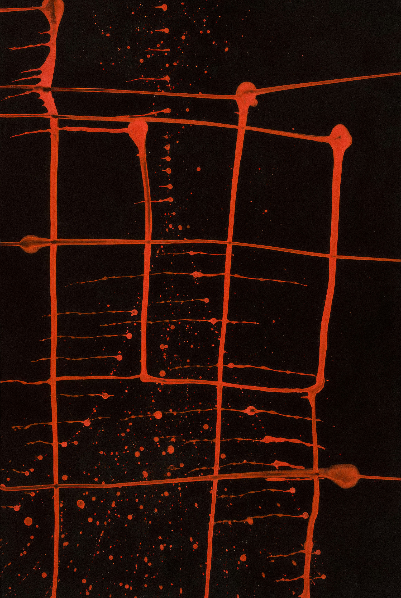
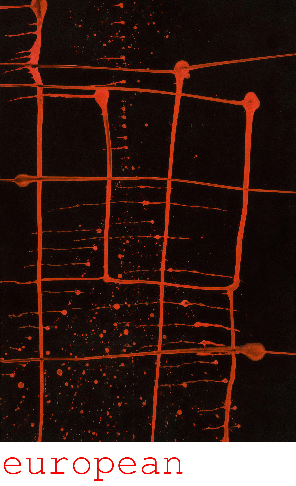

# photoTag

This project helps to add text blocks below the images in bulk. The arguments passed are in the given sequence:
1. Directory name containing images
2. CSV file name containing text to be placed below images
3. Output Directory name
4. Font Size of the text

Given below is an example to run the program
```python3
python3 ipython3 photoTag.py ./sampleInput/ ./datafiles.csv ./output/ 150
```

Input image


Output image


